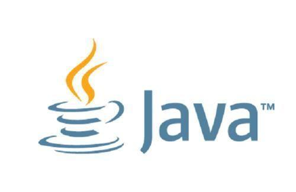
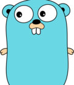

# 个人博客

> 在这个行业也浸淫多年，之前一直认为自己所知甚少，写的blog营养不大，这种想法是不对的。blog除了分享、总结更多的是一种习惯，所以现在开坑，希望能将自己的所见所得与计划分享，可能更要紧的是作为一种督促、总结的方式

目录

* 语言
  - java
  - golang

* web框架
* 中间件
* 分布式系统
* 关于项目的那些事情
* 所思
* 总结

## 语言类

1. **宇宙中的那些星球--java**

1. **Golang学习路线图**

